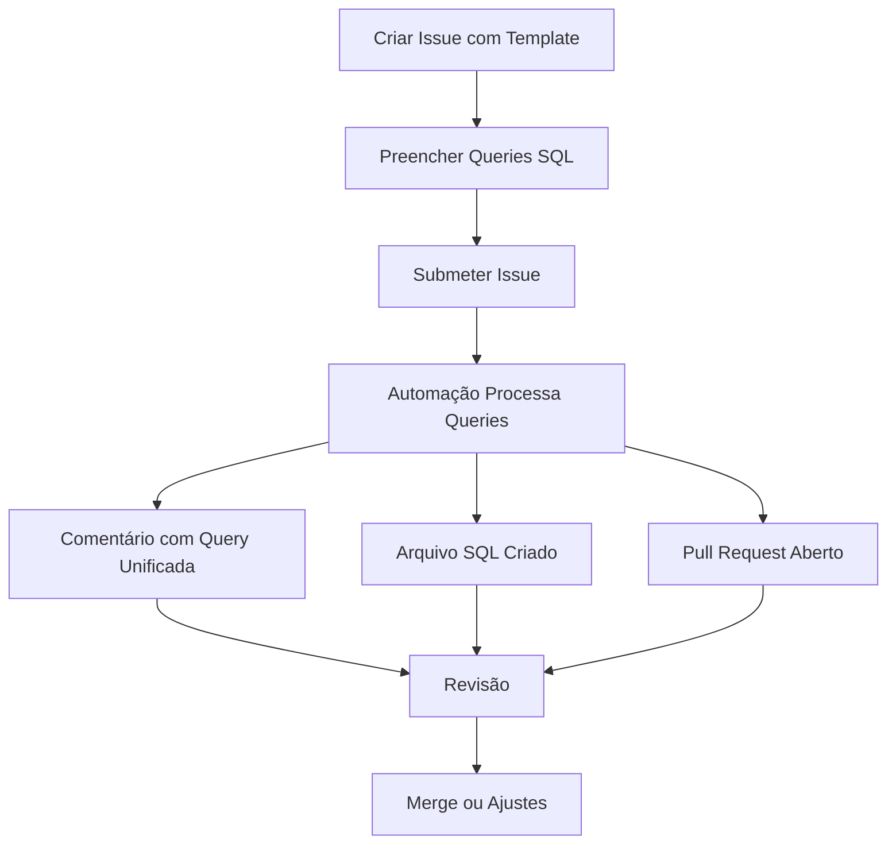

# Orion SQL Query Unifier 🚀

[](https://github.com/seu-usuario/orion)
[](https://www.python.org/)
[](https://github.com/features/actions)

## 📋 Visão Geral

**Orion SQL Query Unifier** é uma solução automatizada para unificar dinamicamente diversas queries SQL (Athena) enviadas via issues do GitHub. O sistema transforma automaticamente as queries isoladas em uma única query otimizada usando Common Table Expressions (CTEs) e UNION ALL, mantendo a consistência estrutural dos dados e garantindo a compatibilidade entre diferentes origens.

## 🎯 Objetivo do Projeto

O Orion resolve um problema comum em ambientes analíticos: a necessidade de consolidar dados de múltiplas fontes com estruturas ligeiramente diferentes. O processo manual de unificação de queries é:

- 🕒 **Demorado** - Requer análise manual de cada query e suas colunas
- 🐛 **Propenso a erros** - Inconsistências podem surgir ao unificar manualmente
- 🔄 **Repetitivo** - O processo precisa ser refeito a cada atualização

Esta automação transforma esse processo manual em um fluxo completamente automatizado baseado em GitHub, permitindo que analistas e engenheiros de dados economizem tempo significativo e reduzam erros.

## ⏱️ Economia de Tempo

A automação proporciona economia de tempo significativa:

| Tarefa | Processo Manual | Com Orion | Economia |
|--------|----------------|----------------------|----------|
| Análise de colunas | 15-30 min por query | Instantâneo | 100% |
| Unificação estrutural | 30-60 min | Instantâneo | 100% |
| Identificação de incompatibilidades | 20-40 min | Instantâneo | 100% |
| Documentação do processo | 15-30 min | Gerada automaticamente | 100% |
| **Total (para 3 queries)** | **2-4 horas** | **< 1 minuto** | **> 99%** |

Em projetos grandes com dezenas de queries para unificar, a economia pode chegar a **dias de trabalho** por projeto.

## 🚀 Principais Funcionalidades

- ✅ **Extração inteligente** de queries SQL de issues do GitHub
- ✅ **Análise e correção** de erros sintáticos simples nas queries recebidas
- ✅ **Identificação de colunas comuns e divergentes** entre as queries
- ✅ **Adição automática** de `NULL AS coluna` para garantir compatibilidade estrutural
- ✅ **Transformação** de cada query em uma CTE bem estruturada
- ✅ **Unificação** via `UNION ALL` respeitando a estrutura de colunas
- ✅ **Documentação automática** do processo com logs detalhados
- ✅ **Integração completa** com GitHub (Issues, Pull Requests, Actions)

## 🔧 Como Utilizar

### Configuração Inicial (Única vez)

1. Clone este repositório ou copie os arquivos para seu projeto:
   ```bash
   git clone https://github.com/seu-usuario/orion.git
   ```

2. Certifique-se de que os arquivos estão na estrutura correta:
   - `query_unifier.py` na raiz do projeto
   - `.github/workflows/sql-query-unifier.yml` para configuração do GitHub Actions
   - `.github/ISSUE_TEMPLATE/sql_query_unification.md` para o template de issues

3. Configure as permissões necessárias para o GitHub Actions no seu repositório:
   - Acesse Settings > Actions > General
   - Certifique-se de que "Read and write permissions" está habilitado

### Uso Diário

1. **Crie uma nova issue** usando o template "SQL Query Unification"
2. **Preencha os campos** solicitados:
   - Nome da tabela final
   - Quantidade de queries
   - Cole cada query no bloco SQL apropriado
3. **Submeta a issue** (a label "sql-query" será adicionada automaticamente)
4. **Aguarde o processamento** (geralmente < 1 minuto)
5. **Verifique os resultados**:
   - Um comentário será adicionado à issue com a query unificada
   - Um arquivo SQL será criado com a query unificada
   - Um Pull Request será aberto para revisão

### Exemplo de Fluxo Completo



## 🌟 Por Que Utilizar Orion

### Para Analistas de Dados
- **Foco no que importa**: Dedique seu tempo à análise dos dados, não à formatação de SQL
- **Consistência garantida**: Resultados padronizados independentemente de quem cria as queries
- **Menos erros**: Elimina problemas comuns de incompatibilidade entre conjuntos de dados
- **Rastreabilidade**: Todo o processo é documentado e versionado no GitHub

### Para Engenheiros de Dados
- **Integração com CI/CD**: Funciona perfeitamente com pipelines existentes
- **Versionamento**: Histórico completo de mudanças nas queries
- **Revisão colaborativa**: Utiliza PR para revisão de código antes da implementação
- **Extensibilidade**: Código modular facilmente adaptável a requisitos específicos

### Para Líderes de Equipe
- **Redução de custos**: Menos tempo gasto em tarefas manuais repetitivas
- **Menor tempo de entrega**: Da solicitação à implementação em minutos, não dias
- **Padronização**: Garante que toda a equipe siga as mesmas práticas
- **Onboarding simplificado**: Novos membros da equipe podem contribuir rapidamente

## 🛠️ Requisitos Técnicos

- Python 3.10+
- Bibliotecas: PyGithub, sqlparse
- GitHub Actions habilitado no repositório
- Permissões de leitura/escrita para o GitHub token

## 📊 Exemplos de Uso

### Antes: Queries independentes

```sql
-- Query 1
SELECT data_contratacao_cliente, cpf_cliente, ano_mes_dia_referencia 
FROM tabela1

-- Query 2
SELECT data_contratacao_cliente, codigo_produto, ano_mes_dia_referencia 
FROM tabela2
```

### Depois: Query unificada com CTEs

```sql
WITH cte1 AS (
  SELECT data_contratacao_cliente, cpf_cliente, ano_mes_dia_referencia 
  FROM tabela1
),
cte2 AS (
  SELECT data_contratacao_cliente, codigo_produto, ano_mes_dia_referencia 
  FROM tabela2
)

-- Query final unificada
SELECT * FROM (
  SELECT data_contratacao_cliente, cpf_cliente, ano_mes_dia_referencia, NULL AS codigo_produto FROM cte1
  UNION ALL
  SELECT data_contratacao_cliente, NULL AS cpf_cliente, ano_mes_dia_referencia, codigo_produto FROM cte2
) AS unified_result;
```

## 👥 Contribuições

Contribuições são bem-vindas! Sinta-se à vontade para abrir issues ou enviar pull requests com melhorias.

## 📄 Licença

Este projeto está licenciado sob a licença MIT - veja o arquivo LICENSE para detalhes.

---

Orion: Desenvolvido com ❤️ para economizar tempo e reduzir erros em análises de dados.