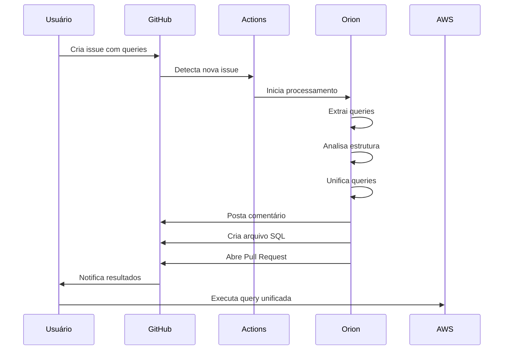

# Orion SQL Query Unifier


[](https://github.com/seu-usuario/orion)
[](https://www.python.org/)
[](https://github.com/features/actions)

## 📌 Sumário

- [Visão Geral](#-visão-geral)
- [Problema Resolvido](#-problema-resolvido)
- [Como Funciona](#-como-funciona)
- [Benefícios](#-benefícios)
  - [Economia de Tempo](#-economia-de-tempo)
  - [Redução de Custos](#-redução-de-custos)
  - [Melhoria na Qualidade](#-melhoria-na-qualidade)
- [Configuração e Uso](#-configuração-e-uso)
  - [Pré-requisitos](#pré-requisitos)
  - [Instalação](#instalação)
  - [Uso Diário](#uso-diário)
- [Arquitetura Técnica](#-arquitetura-técnica)
  - [Componentes](#componentes)
  - [Fluxo de Dados](#fluxo-de-dados)
- [Casos de Uso](#-casos-de-uso)
- [Análise de ROI](#-análise-de-roi)
- [Roadmap](#-roadmap)
- [FAQ](#-faq)
- [Contribuição](#-contribuição)
- [Licença](#-licença)

## 🔍 Visão Geral

O **Orion SQL Query Unifier** é uma solução automatizada que revoluciona o processo de unificação de queries SQL (especialmente para Amazon Athena). Utilizando a infraestrutura do GitHub e inteligência de processamento de SQL, o Orion automatiza completamente o processo de transformar múltiplas queries isoladas em uma única consulta consolidada e otimizada.

### Em Resumo:

- **O que é:** Uma ferramenta de automação para unificar queries SQL dinamicamente
- **Como funciona:** Via GitHub Issues + Actions + Python
- **Benefícios principais:** Economia de tempo, redução de custos e padronização

## 🎯 Problema Resolvido

Em ambientes de análise de dados que utilizam Amazon Athena ou outros serviços similares, analistas frequentemente precisam combinar dados de múltiplas fontes com estruturas semelhantes, mas não idênticas. Este processo tradicionalmente exige:

1. **Análise manual** de todas as consultas originais
2. **Identificação de estruturas de colunas** comuns e divergentes
3. **Adição manual** de colunas nulas para compatibilização
4. **Transformação laboriosa** em CTEs (Common Table Expressions)
5. **Combinação cuidadosa** via UNION ALL
6. **Validação abrangente** para garantir consistência

Este processo é:
- **Extremamente trabalhoso:** Pode levar horas ou dias
- **Propenso a erros:** Omissões ou incompatibilidades são comuns
- **Custoso:** Consultas de teste no Athena geram cobranças constantes
- **Difícil de manter:** Alterações futuras exigem refazer todo o processo

**O Orion elimina completamente estes problemas através da automação total do processo.**

## ⚙️ Como Funciona

O Orion opera em três etapas principais:

### 1. Coleta de Queries
- Usuário cria uma issue no GitHub usando template dedicado
- Usuário fornece as consultas SQL no formato especificado
- A issue é rotulada automaticamente com "sql-query"

### 2. Processamento Automático
- GitHub Actions detecta a nova issue com o rótulo específico
- O script Python extrai as queries do texto da issue
- O algoritmo analisa a estrutura de cada consulta e identifica todas as colunas
- O sistema gera CTEs para cada consulta original
- As consultas são unificadas com UNION ALL, adicionando colunas NULL quando necessário

### 3. Entrega dos Resultados
- O resultado é postado como comentário na issue original
- Um arquivo SQL é criado no repositório
- Um Pull Request é aberto para revisão do código gerado


## 💎 Benefícios

### ⏱️ Economia de Tempo

A automação do Orion proporciona uma economia de tempo dramática:

| Tarefa | Processo Manual | Com Orion | Economia |
|--------|----------------|-----------|----------|
| Análise de colunas | 15-30 min por query | < 1 segundo | 100% |
| Unificação estrutural | 30-60 min | < 1 segundo | 100% |
| Identificação de incompatibilidades | 20-40 min | < 1 segundo | 100% |
| Testes de validação | 30-60 min | < 1 segundo | 100% |
| Documentação do processo | 15-30 min | Automática | 100% |
| **Total (3 queries)** | **2-4 horas** | **< 1 minuto** | **> 99%** |
| **Total (10 queries)** | **1-2 dias** | **< 1 minuto** | **> 99.9%** |

Para um time de 5 analistas que regularmente unificam queries, a economia pode chegar a **40-80 horas por mês**.

### 💰 Redução de Custos

A economia não se limita apenas ao tempo dos analistas, mas também aos custos diretos de processamento no Amazon Athena:

#### Custos do Processo Manual:
- **Consultas de teste:** 5-10 consultas de teste por unificação
- **Dados escaneados:** ~50-100 GB por consulta de teste
- **Custo Athena:** $5 por TB escaneado
- **Total por unificação:** $2.50-$5.00 em custos diretos de AWS

#### Economias Potenciais:
- **Para 20 unificações mensais:** $50-$100 em custos diretos economizados
- **Para 100 unificações mensais:** $250-$500 em custos diretos economizados
- **Economia anual:** $3,000-$6,000 em custos de AWS

Além disso, **o custo do tempo dos analistas** representa a maior economia:
- **Custo médio por hora de analista:** $50-$100
- **Economia mensal (5 analistas):** $2,000-$8,000
- **Economia anual:** $24,000-$96,000

**ROI estimado:** >1000% no primeiro ano

### 📊 Melhoria na Qualidade

Além das economias quantificáveis, o Orion proporciona melhorias significativas na qualidade:

- **Zero erros de sintaxe:** O algoritmo garante compatibilidade estrutural
- **Padronização:** Todas as consultas seguem o mesmo formato otimizado
- **Rastreabilidade:** Histórico completo de quem solicitou cada unificação
- **Colaboração:** Revisão por pares através do sistema de Pull Requests
- **Documentação automática:** Cada unificação é documentada automaticamente

## 🚀 Configuração e Uso

### Pré-requisitos

- Repositório GitHub
- GitHub Actions habilitado
- Python 3.10+

### Instalação

1. Clone este repositório ou copie os arquivos necessários:
   ```bash
   git clone https://github.com/seu-usuario/orion.git
   ```

2. Configure os arquivos de template e workflow:
   ```bash
   cp -r orion/.github your-repo/
   cp orion/process_query.py your-repo/
   ```

3. Instale as dependências necessárias:
   ```bash
   pip install -r requirements.txt
   ```

4. Configure as permissões do GitHub Actions:
   - Acesse Settings > Actions > General
   - Ative "Read and write permissions" para o token GITHUB_TOKEN

### Uso Diário

1. **Criar uma solicitação:**
   - Acesse "Issues" no repositório
   - Clique em "New Issue"
   - Selecione o template "União de Queries SQL"

2. **Preencher o template:**
   - Forneça o nome da tabela final
   - Indique a quantidade de queries
   - Cole cada query no bloco correspondente
   - Adicione informações sobre o objetivo da unificação

3. **Submeter e aguardar:**
   - Envie a issue
   - O sistema processará automaticamente (geralmente em menos de 1 minuto)
   - Você receberá um comentário com a query unificada

4. **Revisar e utilizar:**
   - Revise o Pull Request aberto
   - Aprove ou solicite alterações
   - Após aprovação, o arquivo SQL estará disponível no repositório

Exemplo de fluxo completo:



## 🔧 Arquitetura Técnica

### Componentes

O Orion consiste em três componentes principais:

1. **Interface do Usuário (GitHub Issues)**
   - Templates predefinidos para padronização
   - Sistema de labels para categorização
   - Comentários automáticos para feedback

2. **Motor de Processamento (Python)**
   - `QueryExtractor`: Extrair queries de issues
   - `SQLProcessor`: Analisar e unificar queries
   - `GitHubIntegration`: Gerenciar interações com GitHub

3. **Infraestrutura de Integração Contínua (GitHub Actions)**
   - Gatilhos automáticos baseados em eventos
   - Ambiente de execução seguro
   - Persistência de resultados

### Fluxo de Dados

```
+---------------+     +---------------+     +---------------+
|  Issue GitHub |---->| GitHub Action |---->| process_query |
+---------------+     +---------------+     +---------------+
                                                   |
                                                   v
+---------------+     +---------------+     +---------------+
|  Pull Request |<----| Arquivo SQL   |<----| Query Unifier |
+---------------+     +---------------+     +---------------+
```

## 📚 Casos de Uso

### Caso 1: Relatório Consolidado de Vendas

**Problema:** Analista precisa unificar dados de vendas de três fontes diferentes (e-commerce, lojas físicas e marketplace) com estruturas ligeiramente diferentes.

**Solução Manual:** 3-4 horas de trabalho analisando colunas, testes em Athena, e correções de inconsistências.

**Solução Orion:** 
1. Criar issue com as três queries
2. Receber query unificada em menos de 1 minuto
3. Executar no Athena direto - sem necessidade de testes

**Resultado:** Economia de 3-4 horas de trabalho e $3-5 em custos de AWS.

### Caso 2: Dashboard de Métricas de Múltiplos Sistemas

**Problema:** Equipe de BI precisa consolidar métricas de 8 sistemas diferentes para um dashboard executivo.

**Solução Manual:** 1-2 dias de trabalho, múltiplas iterações, e colaboração entre 2-3 analistas.

**Solução Orion:**
1. Criar issue com as 8 queries
2. Receber query unificada em menos de 1 minuto
3. Usar no dashboard sem modificações

**Resultado:** Economia de 1-2 dias de trabalho e $10-15 em custos de AWS.

### Caso 3: Atualização Mensal de Relatórios

**Problema:** Todo mês, relatórios precisam ser atualizados com dados de novas fontes e estruturas ligeiramente alteradas.

**Solução Manual:** Refazer todo o processo de unificação mensalmente (8-10 horas).

**Solução Orion:**
1. Atualizar issue existente com as novas queries
2. Receber query atualizada em menos de 1 minuto

**Resultado:** Economia de 8-10 horas mensais e $5-10 em custos de AWS.

## 💲 Análise de ROI

### Custos de Implementação
- **Desenvolvimento inicial:** 40 horas de engenheiro ($4,000)
- **Configuração:** 4 horas de DevOps ($400)
- **Treinamento:** 2 horas por equipe ($200 por equipe)
- **Total:** Aproximadamente $5,000

### Economia Anual
- **Tempo de analistas:** $24,000-$96,000
- **Custos diretos de AWS:** $3,000-$6,000
- **Total:** $27,000-$102,000

### ROI
- **Primeiro ano:** 440%-1940%
- **Anos subsequentes:** >2000%

### Payback Period
- **Cenário conservador:** 2.2 meses
- **Cenário otimista:** 0.6 meses

## 🛣️ Roadmap

### Fase 1: Implantação Inicial (Atual)
- ✅ Extração de queries de issues
- ✅ Unificação básica via UNION ALL
- ✅ Integração com GitHub Actions

### Fase 2: Melhorias de Funcionalidade (Próxima)
- 🔄 Suporte para cláusulas GROUP BY e HAVING
- 🔄 Detecção inteligente de incompatibilidades de tipos
- 🔄 Interface web para visualização prévia

### Fase 3: Otimização e Escalabilidade (Futura)
- 📅 Otimização automática de queries
- 📅 Suporte para outros dialetos SQL além do Athena
- 📅 Integração direta com ferramentas de BI

## ❓ FAQ

### Quais são os limites de complexidade das queries?
O Orion suporta a maioria das consultas SQL SELECT, incluindo subconsultas, funções, e joins. Porém, queries com UDFs (funções definidas pelo usuário) podem exigir tratamento especial.

### Como lidar com colunas que têm o mesmo nome mas semântica diferente?
Recomendamos usar aliases explícitos nas queries originais para evitar ambiguidades. O Orion respeitará os aliases fornecidos.

### O Orion funciona com outros bancos de dados além do Athena?
Sim, embora otimizado para Athena, o Orion funciona com qualquer dialeto SQL compatível com o formato de CTEs e UNION ALL.

### Como o Orion lida com erros de sintaxe nas queries originais?
O sistema possui correção básica de erros simples, mas queries com erros graves de sintaxe devem ser corrigidas antes da submissão.

### Existe limite de tamanho ou quantidade de queries?
Não há limite técnico, mas para melhor desempenho, recomendamos unificar até 20 queries por vez.

## 👥 Contribuição

Contribuições são bem-vindas! Para contribuir:

1. Faça um fork do repositório
2. Crie um branch para sua feature (`git checkout -b feature/amazing-feature`)
3. Commit suas mudanças (`git commit -m 'Add some amazing feature'`)
4. Push para o branch (`git push origin feature/amazing-feature`)
5. Abra um Pull Request

## 📄 Licença

Este projeto está licenciado sob a licença MIT - veja o arquivo LICENSE para detalhes.

---

## 📞 Contato

Para dúvidas, sugestões ou contribuições, entre em contato através de:

- **GitHub Issues**: [Criar uma issue](https://github.com/seu-usuario/orion/issues)
- **Email**: [seu-email@exemplo.com](mailto:seu-email@exemplo.com)

---

**Orion SQL Query Unifier** — Transformando horas de trabalho em minutos desde 2023.